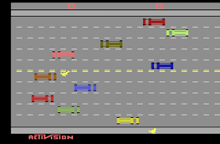

# Projeto "A galinha que atravessou a rua"
## FPRO/LEIC, 2021/22
## Daniel José de Aguiar Gago (up202108791)
## 1LEIC09

### Objetivo

1. Criar um clone do clássico Freeway em Pygame.

### Repositório de código

Link para o repositório do GitHub: https://github.com/lovedzhd/freewayleic

### Descrição

*---É um jogo em que o objetivo é controlar uma galinha que quer chegar ao outro lado da estrada sem ser atropelada pelos automóveis. A galinha com mais pontos vence.---*

### UI

### Pacotes

- Pygame

### Tarefas

1. desenhar os personagens e mapa
2. carregar o mapa com o personagem
3. ler teclas e mover o personagem
4. verificar se o personagem chegou ao fim da estrada, adicionar um ponto e reiniciar a sua posição assim que isso aconteça
5. adicionar automoveis e colisões
6. adicionar 2º personagem para competir
7. adicionar efeitos sonoros
8. adicionar um timer e anunciar o vencedor quando o timer chegar ao fim

- Atualizado a última vez em 15/01/2022
